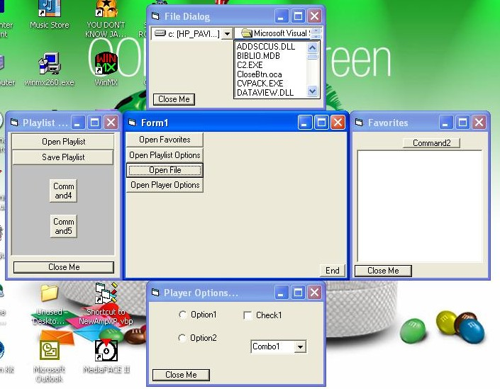



## Magic Windows

### Description

PLEASE Vote for me!!!!!

Magic Windows ver 1.0

Have you ever wanted to have a form that would slide out from behind another form, like a tray? Well now you can.

Simply Drop this control onto a form(the one you will use as the tray) and from anywhere in code you call 2 methods. One will Slide the form out, The other retracts the form back.

You can set the "tray" form to slide out to the right, left, top. or bottom. You can set it to slide out on top of the calling form, or behind the calling form.
 
### More Info
 

             |
---                |---
**Submitted On**   |2002-02-27 16:33:16
**By**             |[David L\. Bracken](https://github.com/Planet-Source-Code/PSCIndex/blob/master/ByAuthor/david-l-bracken.md)
**Level**          |Advanced
**User Rating**    |4.8 (19 globes from 4 users)
**Compatibility**  |VB 6\.0
**Category**       |[Custom Controls/ Forms/  Menus](https://github.com/Planet-Source-Code/PSCIndex/blob/master/ByCategory/custom-controls-forms-menus__1-4.md)
**World**          |[Visual Basic](https://github.com/Planet-Source-Code/PSCIndex/blob/master/ByWorld/visual-basic.md)
**Archive File**   |[Magic\_Wind581252272002\.zip](https://github.com/Planet-Source-Code/david-l-bracken-magic-windows__1-32164/archive/master.zip)

